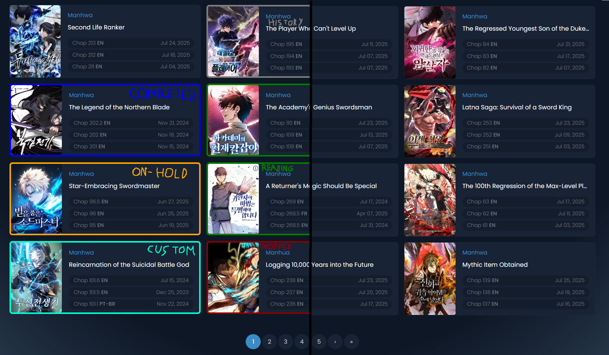

Higlight Borders of Saved Mangas
---

A Chrome extension for [Mangafire](https://mangafire.to/home)
With the pourpose of Highligting or Marking Saved and Read mangas/manhwas.

<dl>
<dt>Solves the Problem</dt>
  <dd>when searching for new things to read, it doesn't show you immidietly, if you have it saved and it also doesn't show you that in a clear way. Same with your history(mangas you read without saving).
</dd>
</dl>

<dl>
<dt>How it works</dt>
<dd>On command Scrapes your Bookmarks(Saved mangas) and/or your History(Read Mangas) for names and statuses(Reading, Completed, Dropped...).
Every time you load MangaFire page it checks if mangas shown match with scraped data and if so, colors the border.
</dd>
</dl>

<dl>
<dt>Extension offers multiple options:</dt>
<dd>1. Sync Mangas automaticly every user set days,
2. Custom border size when Highlighting/Marking,
3. Marking your History the same way as Saved mangas,
4. and more.</dd>
</dl>

Download the folder(less than 1Mb) go to chrome://extensions enable developer mode(top right) and Load unpacked(top left).
> IMPORTANT! you have run the scraper at least once, for the extension to know what to Highlight(Click Sync Bookmarks, on either extensions popup or settings page.)

***

This is not official MangaFire extension and is not affiliated with MangaFire in any way.
All CSS is from [universe.io](https://uiverse.io/) with [MIT License(open source)](https://opensource.org/license/mit).
