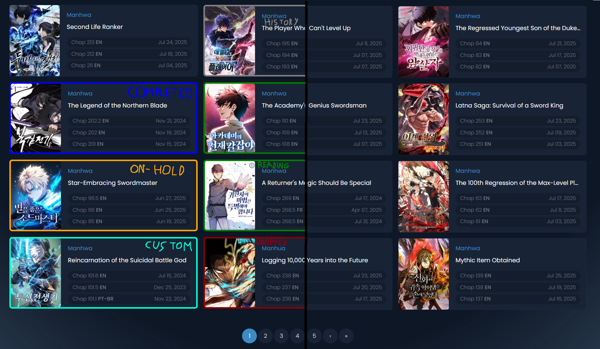

# MangaFire & Multi-Site Content Manager

A powerful Chrome Extension designed for **MangaFire.to**, **MangaDex**, **Asura Scans**, and **Webtoons**. It enhances your browsing experience by automatically highlighting manga based on your bookmarks, tracking your reading history across platforms, and syncing your library between devices.

## 🚀 Why Use This?
Reading across multiple sites can be disjointed. You lose track of chapters, and bookmarks are scattered. 
**Content Manager** solves this by:
1. **Unifying your library**: A single dashboard for all your manga, regardless of the source.
2. **Visual Tags**: Injecting colored status borders (e.g., "Reading", "Plan to Read") directly onto the websites you browse.
3. **Cloud Sync**: seamless cross-device synchronization using your own **Google Drive**.

## ✨ Key Features

### 🌍 Cross-Platform Support
- **Supported Sites**: MangaFire, MangaDex, Asura Scans, Webtoons, Manganato, MangaPlus.
- **Universal Tracking**: Reading progress is saved automatically no matter which site you use.

### ☁️ Cloud Sync & Backup
- **Google Drive Integration**: Connect your Google Account to sync your library, history, and settings across all your computers.
- **Private Data**: Your data is stored in a private "App Data" folder in your Drive—secure and invisible to others.
- **Conflict Resolution**: Smart handling of data conflicts (Newer wins/Local wins/Cloud wins).

### 🎨 Visual & Reader Enhancements
- **Smart Highlighting**: Instantly spot your saved manga with custom colored borders while browsing.
- **Quick Actions Overlay**: Hover over covers on supported sites to update status or rating without leaving the page.
- **Auto-Scroll**: Hands-free reading with adjustable speed controls.
- **Progress Tracking**: Remembers your exact scroll position within chapters.

### 📊 Advanced Library Dashboard
- **New Tab Dashboard**: Optionally replaces your new tab page with a rich library overview and "Next Up" recommendations.
- **Statistics**: Visualize your reading habits with detailed charts (Format distribution, Status breakdown).
- **Bulk Operations**: Mass-update manga statuses or clean duplicates with one click.
- **Smart Filters**: Filter by Status, Format, Genre, Demographic, or "Binge-worthy" length.

### 🤖 Smart Automation
- **Sync & Mark Read**: Automatically detects when you read a chapter and updates your local library.
- **Smart Resume**: Predicts the next chapter you want to read and puts it one click away.
- **Inactivity Fade**: Visually dims entries you haven't touched in 30+ days.

## 🔒 Privacy & Security
This extension is built with a **Privacy-First** approach:
- **Local-First**: Primary database is stored in `chrome.storage.local`.
- **User-Owned Cloud**: Cloud sync uses *your* Google Drive. We assume no improved liability for external servers.
- **No Tracking**: No analytics, no behavioral tracking, no third-party data collection.

## 🛠️ Installation
1. Download or Clone this repository.
2. Go to `chrome://extensions/` in your Chrome browser.
3. Toggle **Developer mode** in the top right corner.
4. Click **Load unpacked** in the top left.
5. Select the folder containing this extension.

## 📖 Getting Started
1. **Import Data**: If you have a list on MangaDex or AniList, use the **Import** tab to populate your library immediately.
2. **Browse**: Go to any supported site (e.g., MangaFire). You'll see status markers on manga you've imported.
3. **Read**: Open a chapter. The extension will automatically track your progress.
4. **Sync**: Enable Google Drive sync in the **Profile** tab to keep your other devices in loop.

## ⚠️ Disclaimer
- This is an **unofficial** tool and is not affiliated with any of the supported manga websites.
- Use responsibly.

## ⚖️ Terms of Service
By using this software, you agree that:
1.  **Usage**: You may not sell, resell, or commercially exploit this software.
2.  **Privacy**: We do not collect your data; you are responsible for your own data security.
3.  **Jurisdiction**: Disputes are governed by the laws of **Slovenia**.

---
*Version 5.0.0*
