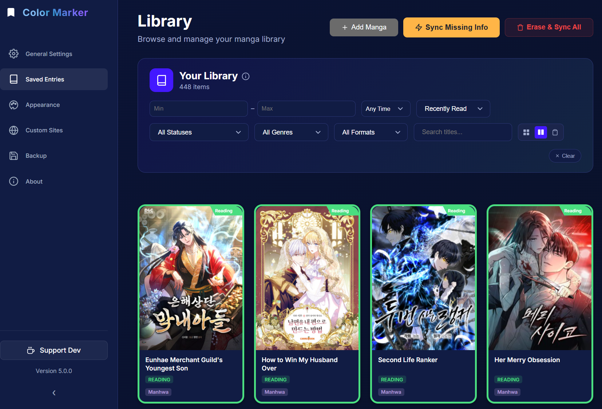

# Bookmarks Marker & Highlighter (Universal Content Manager)

Universally tracks what Mangas, Manhuas and Manwas you read, saves them to its own library and then higlights those specific comics on any other website depending on saved status(automaticly gives status 'reading'). with a unified library and other QoL features.

## Why Use This?
Reading and tracking content across multiple disjointed sites is a hassle. You lose track of chapters, and bookmarks are scattered across different platforms. 

**Bookmarks Marker & Highlighter** solves this by:
1. **Unifying Your Library**: A single, beautiful dashboard with dynamic pagination for all your content, regardless of the source.
2. **Visual Tags & Highlighting**: Injecting custom-styled status borders, **QoL buttons** and status ribbons directly onto the websites you browse.
3. **Automatic Tracking**: works on any website only with your approval and setup.

---

## Key Features

### Universal Custom Site Support
- **Visual Selector Tool**: Teaching the extension how to recognize content on any site is simple. Use our guided selector panel to highlight elements and save DOM rules.
- **Card & Reader Selectors**: Map card containers and titles for main site highlights, and configure reader selectors to automatically track exact chapter pages.
- **Variant Support**: Handles complex site layouts (e.g., Grid vs. List views) by letting you create multiple selector variant groups.

### Local Backup
- **JSON Exports**: Export your entire library, custom site rules, custom categories, and extension settings into a single, clean JSON file.
- **Custom Sites backup**: specific backup only for all configered websites.

### Visual & Reader Enhancements
- **Custom Status Markers**: Instantly spot your saved content with custom status borders (Reading, Completed, On Hold, etc.) and corner ribbons.
- **Quick Actions Overlay**: Hover over content on configured sites to access instant update actions (e.g., change status, view details, contionoue reading).
- **Progress Tracking**: Remembers your reading history and last read chapter across all your configured sites automatically.

### Advanced Library Dashboard

- **Centralized Management**: A powerful, standalone options page featuring Large, Compact, and List viewing modes.
- **Rich Metadata Integration**: Safely and asynchronously retrieves tags, links, and detailed metadata from **AniList** and **MangaDex** to enrich your collection views.
- **Advanced Filtering**: Filter by Status, Genre, Demographics, or your own custom-created categories with a fast, real-time query interface.

---

## Privacy-First Architecture
This extension is built with absolute respect for your privacy:
- **Local-First Storage**: Your primary database and history reside completely within the browser's `chrome.storage.local` API.
- **Zero Third-Party Tracking**: No behavioral tracking, no third-party analytics scripts, and no external user-profile databases.
- **User-Controlled Connectivity**: External API calls are limited strictly to AniList/MangaDex for metadata fetching and standard host rules for your custom sites.

---

## Installation
1. Clone or download this repository to your local machine.
2. Open Google Chrome and navigate to `chrome://extensions/`.
3. Toggle **Developer mode** in the top right corner.
4. Click **Load unpacked** in the top left.
5. Select the `dist` folder to install.

---

## Getting Started
1. **Add Custom Sites**: Navigate to the **Custom Sites** tab in the Options dashboard and use the guided Visual Selector Tool to configure highlights on your favorite domains.
2. **Populate Your Library**: Visit any supported site. Hover over manga cards and use the **Quick Actions Overlay** to save them directly to your library.
3. **Track Your Progress**: Open a chapter or reader page. The extension will automatically update your reading history based on your reader configuration.
4. **Export & Backup**: Regularly use the **Backup** tab to save a copy of your library and site configurations to your computer.

---

## Terms of Service & License
By using this software, you agree that:
1. **Usage**: Provided for personal, non-commercial use only. You may modify the code for personal use, but selling or commercially exploiting the software is strictly prohibited.
2. **Liability**: The software is provided "as is", without warranty of any kind. You are responsible for backing up your data.
3. **Jurisdiction**: These terms and any disputes are governed in accordance with the laws of **Slovenia**.

---
*Version 5.0.0*
