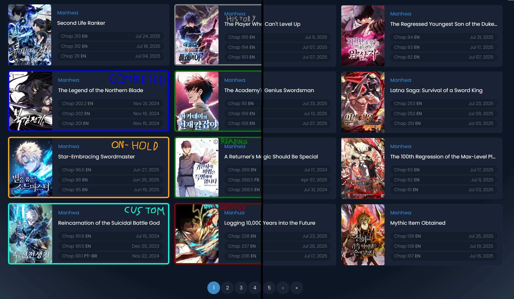

# Universal Content Manager

A powerful Chrome Extension originally designed for Manga reading, now evolved into a universal tracking tool. It enhances your browsing experience by automatically highlighting content based on your bookmarks, tracking your reading history across platforms, and syncing your library between devices.

## 🚀 Why Use This?
Reading across multiple sites can be disjointed. You lose track of chapters, and bookmarks are scattered. 
**Universal Content Manager** solves this by:
1. **Unifying your library**: A single dashboard with dynamic pagination for all your content, regardless of the source.
2. **Visual Tags**: Injecting colored status borders, glowing effects, and status ribbons directly onto the websites you browse.
3. **Cloud Sync**: Seamless cross-device synchronization using your own **Google Drive**.

## ✨ Key Features

### 🌍 Universal Custom Site Support
- **Supported Sites**: Any site! Use the visual Selector Tool to add tracking and highlighting support to any website tailored to your DOM selectors.
- **Universal Tracking**: Reading progress is saved automatically no matter which configured site you use.

### ☁️ Cloud Sync & Backup
- **Google Drive Integration**: Connect your Google Account to sync your library, history, and settings across all your computers.
- **Private Data**: Your data is stored in a private "App Data" folder in your Drive—secure and invisible to others.

### 🎨 Visual & Reader Enhancements
- **Universal Status Markers**: Instantly spot your saved content with custom status borders (Reading, Completed, etc.), dynamic glows, and corner ribbons.
- **Quick Actions Overlay**: Hover over content on supported sites to get access to quick update actions and details.
- **Progress Tracking**: Remembers your exact scroll position and last read chapter across all devices.

### 📊 Advanced Library Dashboard
- **Centralized Management**: A powerful standalone library page offering Large, Compact, and List viewing modes.
- **Detailed Statistics**: Visualize your reading habits with distribution charts, format metrics, and status breakdowns.
- **All the Filters**: Filter by Status, Format, Genre, Demographic, or Custom Status.

### 🤖 Smart Automation
- **Sync & Mark Read**: Automatically detects when you read a chapter and updates your local library.
- **Smart Resume**: Predicts the next chapter you want to read and puts it one click away.
- **Auto Read Stale**: Automatically moves "Reading" entries to "Read" after 30+ days of inactivity.

## 🔒 Privacy & Security
This extension is built with a **Privacy-First** approach:
- **Local-First**: Primary database is stored in `chrome.storage.local`.
- **User-Owned Cloud**: Cloud sync uses *your* Google Drive. We assume no improved liability for external servers.
- **No Tracking**: No behavioral tracking, no third-party data collection.

## 🛠️ Installation
1. Download or Clone this repository.
2. Go to `chrome://extensions/` in your Chrome browser.
3. Toggle **Developer mode** in the top right corner.
4. Click **Load unpacked** in the top left.
5. Select the 'dist' folder containing this extension.

## 📖 Getting Started
1. **Import Data**: If you have a list on MangaDex or AniList, use the **Import** tool in the Profile tab to populate your library immediately.
2. **Create Custom Sites**: Navigate to the Custom Sites tab and select elements with guided instructions to track/highlight elements on your favorite domains.
3. **Browse**: Go to any supported site. You'll see status markers (borders, glow, ribbons) on content you've imported.
4. **Read**: Open a chapter or reader page. The extension will automatically track your progress depending on the reader selectors you set up.
5. **Sync**: Enable Google Drive sync in the **Profile** tab to keep your other devices in the loop.

## ⚠️ Disclaimer
- Use responsibly. Just kidding lol. You can be a law abiding citizen or a pirate, the extension doesnt discriminate and its completly safe.

## ⚖️ Terms of Service
By using this software, you agree that:
1.  **Usage**: You may not sell, resell, or commercially exploit this software. Modify if you wish.
2.  **Privacy**: We do not collect your data; you are responsible for your own data security.
3.  **Jurisdiction**: Disputes are governed by the laws of **Slovenia**.

---
*Version 5.0.0*
